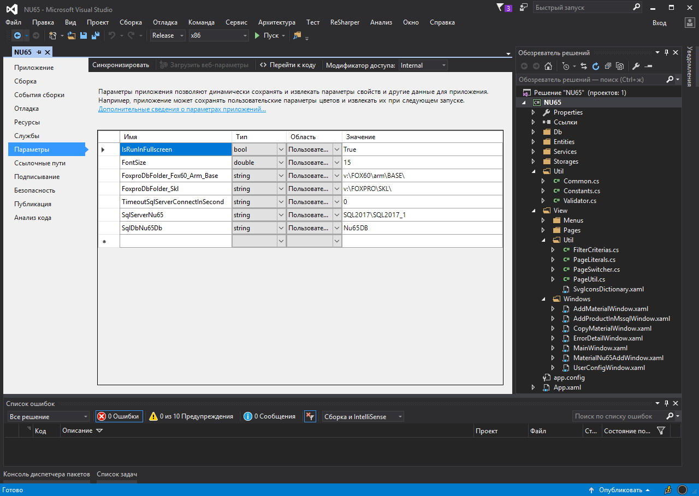
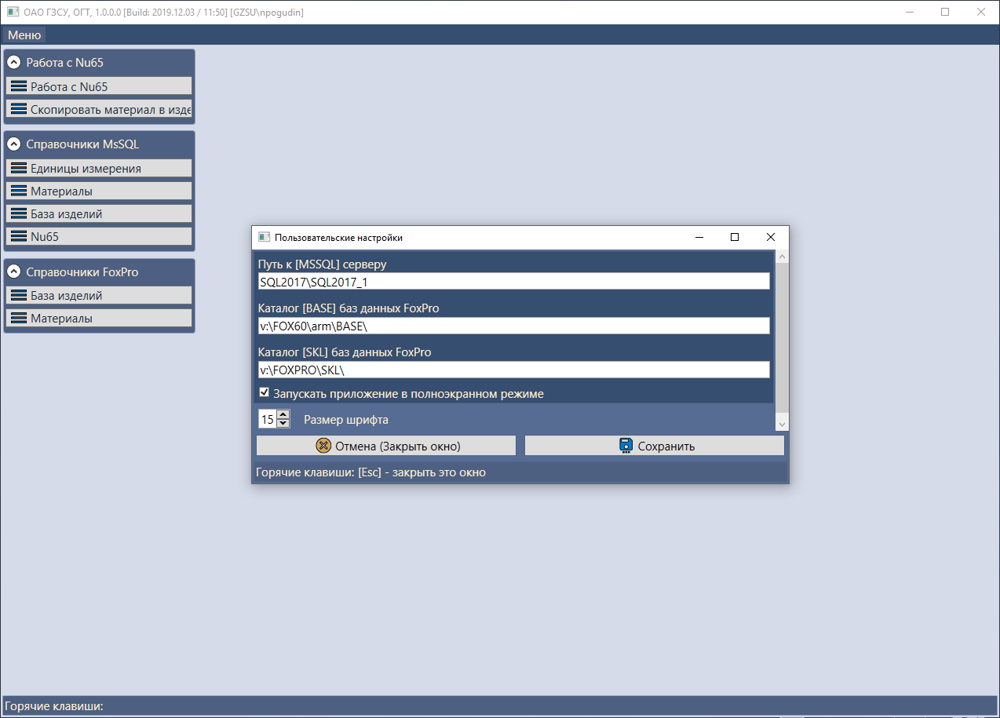
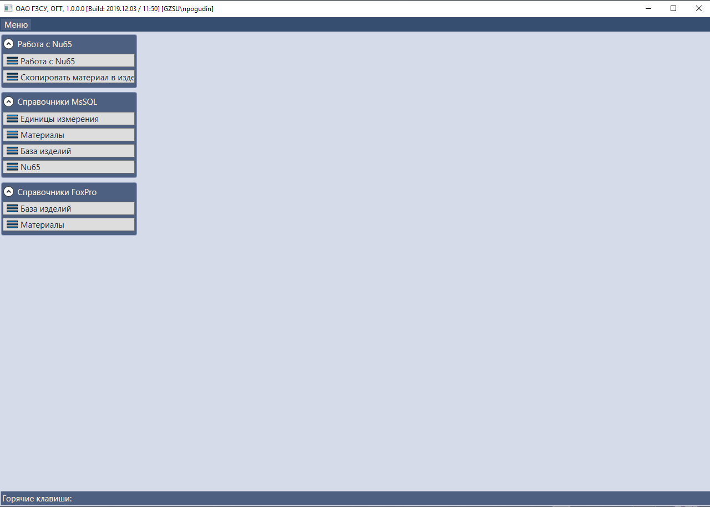
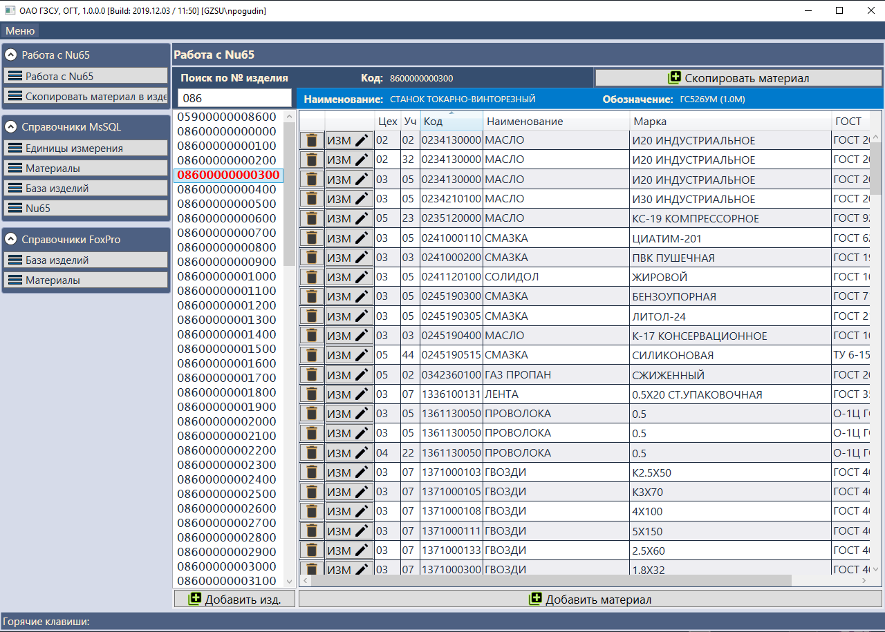
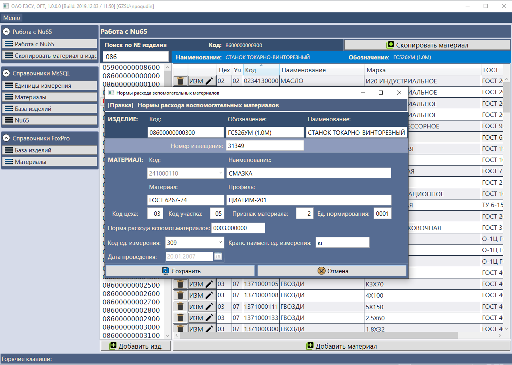

# Nu65

Рабочее название: *Nu65*  
Приложение **АРМ Nu65** - десктоп-приложение для склада №65. Предназначена для ведения норм расхода вспомогательных материалов изделий на предприятии. Приложение одновременно работает с новой MSSQL базой и со старой DBF базой, которая используется другими старыми FoxPro приложениями предприятия.

Вместе с проектом лежат *_nu65Transfer (vs10 support)* для трансфера данных из nu65a.dbf в MSSQL и *_transferNu65inDbf (vs10 support)* для трансфера данных из MSSQL в nu65a.dbf на случай непредвиденной порчи данных в одной из БД.

### Требуемые базы данных:  
- Внутренняя база данных этого приложения **[Nu65Db]** (версию для разработки можно инициализировать скриптом)

### А так же DBF базы предприятия: 
- Таблица норм расхода вспомогательных материалов используемая в старых приложениях [nu65a.dbf] 
- Таблица всех материалов и изделий [prdsetmc.dbf] 
- Таблицы цен материалов [cenmat.dbf]

### Параметры инициализации в IDE  
Параметры инициализации проекта на каждой машине разработчика (все файлы настроек описаны в .gitignore, дабы не перезатирать при каждом коммите): 

Параметр | Тип | Значение | Комментарий 
-------- | --- | -------- | -----------
IsRunInFullscreen               | bool   | True                 | Признак запуска приложения в полноэкранном режиме 
FontSize               			| double | 15                   | Размер шрифта
FoxproDbFolder_Fox60_Arm_Base  	| string | v:\FOX60\arm\BASE\   | Путь до dbf таблиц базовых
FoxproDbFolder_Skl              | string | v:\FOXPRO\SKL\       | Путь до dbf таблиц складов
TimeoutServerConnectInSecond    | int    | 0                    | Таймаут ответа от сервера (в секундах)
SqlServerNu65                 	| string | SQL2017\SQL2017_1    | MSSQL-сервер с базой данных Nu65
SqlDbNu65Db                     | string | Nu65Db        		| База данных Nu65 

### Скриншоты окна настроек и рабочего приложения  

  

  

  

  

  

  